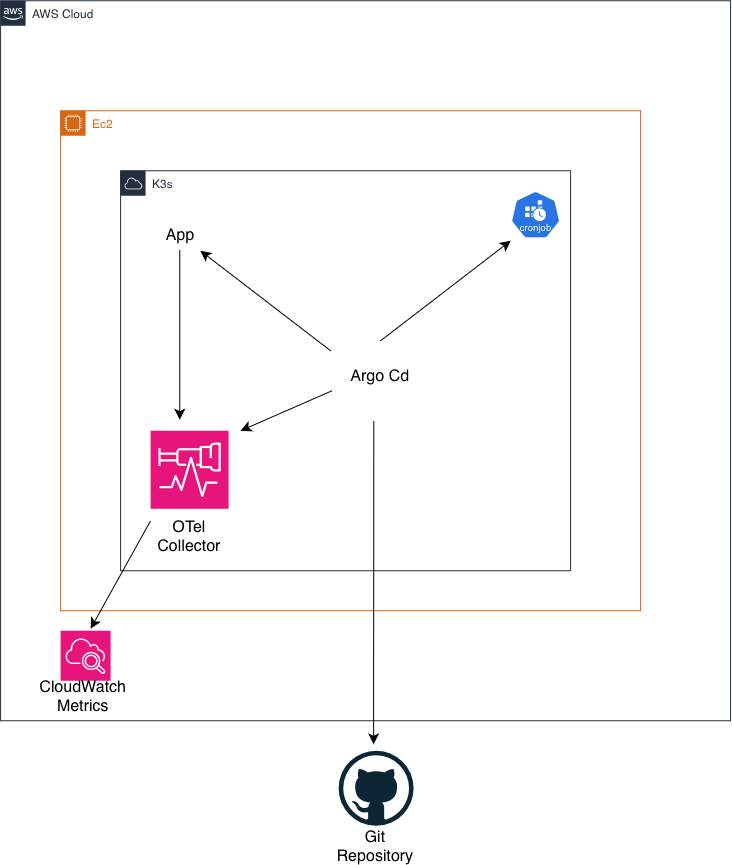

# Kubernetes by the Hour

A single-node Kubernetes cluster, self-hosted on an IPv6-only EC2 instance,
deployed and kept in sync entirely through GitOps — with no public IPv4
address anywhere on the node, and no `kubectl apply` run by hand for
anything the cluster is actually supposed to be running.

The name is literal. This isn't a managed control plane billed by the
month; it's k3s on a single `t3.small`, built to be destroyed and rebuilt
on demand, priced and monitored like something meant to exist for a
bounded stretch of time rather than indefinitely.

## The idea, in one line

Everything the cluster runs comes from a public Git repo. Argo CD watches
it, applies whatever's there, and reverts anything applied by hand that
drifts from it (`selfHeal: true`). The only things ever touched directly
with `kubectl` are the two bootstrap objects that tell Argo CD what to
watch in the first place — after that, `git push` is the deployment
mechanism.

The cluster also watches its own GitOps loop, a `CronJob` checks every 15 minutes
whether Argo CD's applications are actually `Synced`, and only then
publishes a CloudWatch metric. No metric for two periods in a row, and an
alarm fires — not because anything threw an error, but because the thing
that's supposed to keep happening, quietly stopped.

## Architecture



One VPC, IPv6-only by design: the node has no public or private IPv4
egress path of its own, reaches the internet for outbound IPv6 traffic
through an egress-only internet gateway, and is administered exclusively
over Tailscale — no SSH port exposed to the internet, no bastion, no
public IP on the instance at all. AWS still requires an IPv4 CIDR on the
VPC even when nothing uses it; that's the one IPv4 footprint that
couldn't be designed away.

On top of that node: k3s as the Kubernetes distribution, Argo CD watching
`gitops/` in this repo, and three workloads it manages — an nginx sample
app, an OpenTelemetry Collector shipping host metrics to CloudWatch, and
the sync-freshness `CronJob` described above.

## What's actually worth reading here

**GitHub doesn't speak IPv6, and an IPv6-only node needs a real answer
for that, not a workaround.** k3s's own installer and Argo CD's install
manifest both pull from GitHub. An IPv6-only node has no route to any
IPv4-only host on the internet by default — and GitHub, still, has no
`AAAA` record for anything that matters (confirmed with `dig`, not
assumed). The fix is AWS's own documented pattern for exactly this
situation: NAT64 + DNS64. DNS64 synthesizes an IPv6 address for
IPv4-only destinations under the `64:ff9b::/96` prefix; a NAT gateway
translates it back to real IPv4 on the way out. It's real infrastructure
with a real monthly cost, not a free trick — see **Cost**, below.

**An unpinned AMI reached in and destroyed a running node over an
unrelated change.** The node's AMI was selected with a `data "aws_ami"`
block set to "most recent" instead of a fixed ID. Applying a change to
the *budget* — nothing to do with the node — picked up a newer AMI that
had shipped in the meantime, and Terraform correctly treated that as
"replace the instance," taking k3s, Tailscale's device identity, and
Argo CD down with it. Nothing was misconfigured in the sense of being
wrong; it was misconfigured in the sense of being *unpinned*, which is a
different and easier mistake to make. Fixed by pinning the AMI to an
explicit ID behind a variable, with a comment stating outright that
bumping it is a deliberate, reviewed action from here on, never an
automatic one. Full incident, including the recovery, is in
`TROUBLESHOOTING.md`.

**k3s's own pod network turned out to be IPv4-only, underneath a node
that's IPv6-only.** The most expensive lesson in this repo. NAT64/DNS64
worked perfectly from the node's own shell — a plain `curl` from the
host always got through. The same request, made from inside a Pod,
failed instantly with `Network unreachable`, on every synthesized
address, no exceptions. k3s's default install never configures a
dual-stack pod CIDR, so the Pod network (flannel, `10.42.0.0/16`) never
had an IPv6 route to begin with, regardless of anything correct
happening at the node or VPC level. Every Pod that needs real outbound
IPv6 — the OpenTelemetry Collector, Argo CD's own `repo-server`, the
freshness `CronJob` — runs with `hostNetwork: true` as the practical fix:
it uses the node's network namespace directly instead of the Pod
overlay, bypassing the gap entirely rather than living inside it. That's
a real tradeoff (less network isolation for those specific Pods, not a
systemic one), documented rather than hidden, and the honest fix — a
proper dual-stack k3s install — is called out as unfinished work below.

**The freshness alarm has been proven to fire, on purpose, with the
CronJob suspended by hand and the recovery captured right alongside
it.** Same standard as Alarm on Absence: not a screenshot, the actual
`describe-alarm-history` output, both transitions, with the reason
verbatim. See [`PROOF.md`](PROOF.md).

## Cost

This is not a free-tier project, and the design says so up front rather
than discovering it in the bill. A `t3.small` running continuously is
roughly $15/month; the NAT gateway that makes GitHub and CloudWatch
reachable from an IPv6-only node is roughly $32/month on top of that —
together, the floor for the permanent piece alone is around $47-48/month
even before anything else runs. A budget with a `cost_filter` scoped to
this project's own tag (not the whole AWS account — see
`TROUBLESHOOTING.md` for the bug that made that necessary) enforces a
$70 ceiling covering both this permanent piece and the `eks-drill/`
weekends described below, for the roughly one-month lifespan the whole
project is scoped to before a full teardown.

Leaving the NAT gateway running continuously, instead of tearing it down
between sessions, was a deliberate call: Argo CD needs to reach GitHub
continuously, not once like a one-time install script, so there's no
"idle" window where turning the NAT off would be free. Reusing the
already-proven NAT64/DNS64 setup cost less, in both time and money, than
switching the repo to a host with native IPv6 or standing up a
self-hosted git server just to avoid a $32/month line item on a project
with a fixed, short lifespan.

## Deploying it

```bash
cd bootstrap
terraform init
terraform apply          # creates the remote state bucket

cd ..
terraform init            # picks up the S3 backend
cp terraform.tfvars.example terraform.tfvars   # fill in your own alert email + Tailscale auth key
terraform apply
```

Once the node is up and k3s and Argo CD are installed (see
`TROUBLESHOOTING.md` for what that installation actually looked like, on
an instance with no shell access but Tailscale SSH), the only manual
`kubectl` step left is bootstrapping Argo CD itself:

```bash
kubectl apply -f argocd-apps/
```

From that point on, everything under `gitops/` is Argo CD's problem, not
yours.

## What's next

A proper dual-stack k3s install — real `--cluster-cidr`/`--service-cidr`
flags covering both IPv4 and IPv6 — so `hostNetwork: true` stops being
the answer for every Pod that needs to leave the cluster, and becomes
unnecessary instead of standard practice. That's a full k3s and Argo CD
reinstall, not a patch, which is why it's staying on the list rather than
getting done quietly.

Beyond that: `eks-drill/`, a deliberately separate piece with its own
state and budget — spinning up a real EKS cluster for two bounded
weekend exercises, killing a node and timing the Auto Scaling Group's
recovery, and comparing that managed recovery path against what this
single self-hosted node can actually do on its own.
